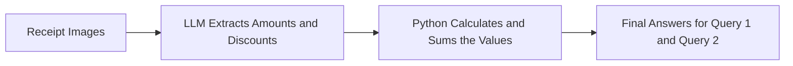

# FTEC5660 Homework 1: Receipt Chain

Build a LangChain pipeline that reads every supermarket receipt in a folder
with the vision-capable DeepSeek Flash model and answers these two questions:

1. How much money did I spend in total for these bills?
2. How much would I have had to pay without the discount?

For this homework, **amount spent** means the final payment after the receipt's
rounding line. **Without the discount** means the sum of the original positive
item prices: add back every promotion, coupon, member, app, packaging-damage,
and percentage discount, but do not add back rounding.

## Student task

Only edit the two functions in `hw1.py` that contain `### YOUR CODE HERE`:

- `build_chain()` creates your LangChain chain.
- `answer_queries()` runs the chain on the receipt images and returns one final
  response for each question.

You may use prompt chaining, routing, parallel calls, reflection, or a
combination. Your final responses should each contain one HKD amount. Do not
hard-code filenames or public answers; grading uses unseen receipt folders.

## Setup and public test

```bash
python3 -m venv .venv
source .venv/bin/activate
pip install -r requirements.txt
```

Put your DeepSeek key after `DEEPSEEK_API_KEY=` in `.env`, then run:

```bash
python3 hw1.py --image-folder public_test
```

The program creates `results.csv` in the current directory. Its columns are
`query`, `model_response`, and `correctness`. The public answers are in
`public_test/ground_truth.json`. The starter intentionally returns the dummy
response `please design your chain to answer these two queries.` so it runs
before you add any API code.

The required model is `deepseek-v4-flash-vision-exp`, the vision-capable
DeepSeek Flash model. JPEG, PNG, GIF, and WebP inputs are accepted by the
homework runner.


## Homework 1 solution: 
In my solution, I use the LLM only as a value extraction engine, while all calculations are performed in Python because LLMs are not always reliable at arithmetic. When I asked the model to calculate the totals directly, the results were not accurate enough. In my code, build_chain() creates a LangChain pipeline using the deepseek-v4-flash-vision-exp vision model. The prompt instructs the model to read each receipt image and return a JSON object containing the final amount paid after rounding, the subtotal after all discounts but before rounding, and a list of all discount amounts converted to positive numbers. When answer_queries() runs the chain, Python calculates the answer to Query 1 by adding the final amounts paid after rounding from all receipts. For Query 2, Python adds the subtotal before rounding to the sum of all discounts for each receipt and then adds together the results from all receipts. In this way, the LLM is responsible only for extracting values, while Python performs all arithmetic calculations.

### Visualization


