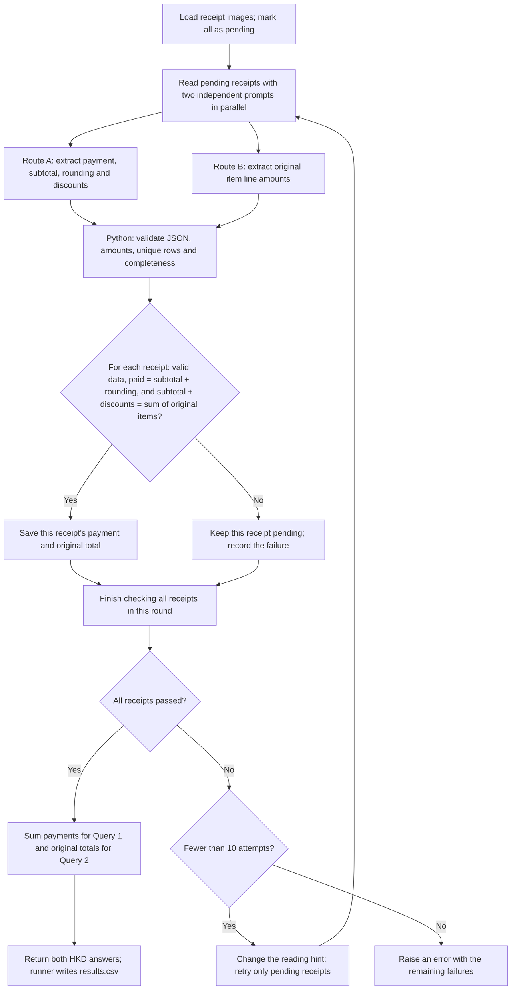

# FTEC5660 Homework 1: Receipt Chain

Build a LangChain pipeline that reads every supermarket receipt in a folder
with the vision-capable DeepSeek Flash model and answers these two questions:

1. How much money did I spend in total for these bills?
2. How much would I have had to pay without the discount?

For this homework, **amount spent** means the final payment after the receipt's
rounding line. **Without the discount** means the sum of the original positive
item prices: add back every promotion, coupon, member, app, packaging-damage,
and percentage discount, but do not add back rounding.

## Student task

Only edit the two functions in `hw1.py` that contain `### YOUR CODE HERE`:

- `build_chain()` creates your LangChain chain.
- `answer_queries()` runs the chain on the receipt images and returns one final
  response for each question.

You may use prompt chaining, routing, parallel calls, reflection, or a
combination. Your final responses should each contain one HKD amount. Do not
hard-code filenames or public answers; grading uses unseen receipt folders.

## Setup and public test

```bash
python3 -m venv .venv
source .venv/bin/activate
pip install -r requirements.txt
```

Put your DeepSeek key after `DEEPSEEK_API_KEY=` in `.env`, then run:

```bash
python3 hw1.py --image-folder public_test
```

The program creates `results.csv` in the current directory. Its columns are
`query`, `model_response`, and `correctness`. The public answers are in
`public_test/ground_truth.json`. The starter intentionally returns the dummy
response `please design your chain to answer these two queries.` so it runs
before you add any API code.

The required model is `deepseek-v4-flash-vision-exp`, the vision-capable
DeepSeek Flash model. JPEG, PNG, GIF, and WebP inputs are accepted by the
homework runner.


## Homework 1 solution:



My main idea is to let the model read the receipts and let Python do the maths. 

In `build_chain()`, I use `deepseek-v4-flash-vision-exp` with two different prompts. The first asks for the final payment, the subtotal before rounding, the rounding adjustment, and each discount. The second asks for the original amount on each item line. These two requests run in parallel through `RunnableParallel`, and neither sees the other's answer. Both return JSON with amounts and short text from the receipt. For items with a quantity greater than one, I ask for the whole line amount, so Python does not multiply it by the quantity again.

In `answer_queries()`, Python uses `Decimal` to calculate exact monetary values and checks two things:

- Does the subtotal before rounding plus all the discounts equal the sum of the original item amounts?
- Does the subtotal before rounding plus the signed rounding adjustment equal the final payment?

Rounding is kept separate from discounts. For example, if the subtotal is HK$394.72 and rounding is -HK$0.02, the actual payment is HK$394.70. The original total comes from adding discounts to HK$394.72, or directly adding the original item amounts.

I also check that the JSON and amounts are valid, that the same receipt row has not been counted twice, and that both branches report `complete=true`. Two separate rows with the same amount are still counted separately. Explanatory notes do not cause a failure by themselves. 

If a receipt fails, I ask both branches to read it again. Only failed receipts are retried; the ones that passed are saved. Each attempt uses a different reading hint, such as scanning from the bottom or paying closer attention to faint digits. I do not send the previous totals back to the model, and I do not mix answers from different attempts. I currently allow nine retries after the first attempt, so each receipt gets at most ten attempts. If it still fails, the program raises an error instead of guessing.

Once every receipt passes, Python adds up the final payments for Query 1 and the original item totals for Query 2, then returns both answers in HKD. 
